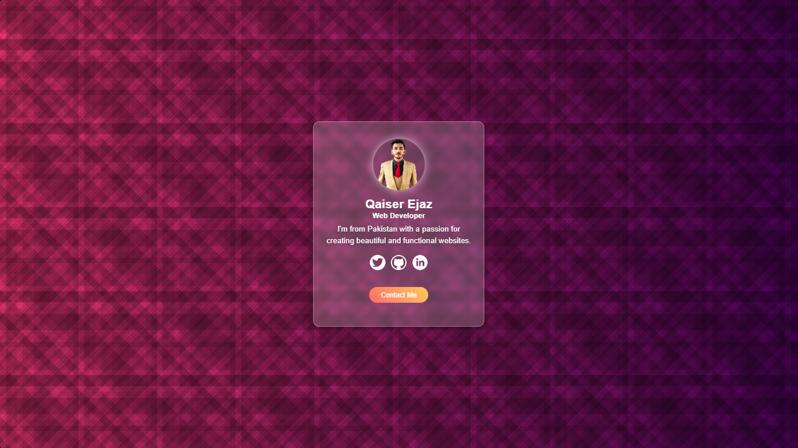

# Glassmorphism Profile Card

A modern, interactive profile card built with HTML, CSS, and JavaScript, featuring a glassmorphism design, tilt effect, and subtle animations. This project showcases a personal profile with social media links and a contact button, styled with a sleek glassmorphism aesthetic.

## 🚀 Features
- **Glassmorphism Design**: A frosted glass effect with blurred background and subtle transparency.
- **Interactive Tilt Effect**: Hover over the card to see a 3D tilt effect powered by `vanilla-tilt.js`.
- **Animations**: Smooth entrance animation, pulsing profile image, and staggered social link fade-ins.
- **Responsive Design**: Adapts to different screen sizes for a seamless experience on mobile and desktop.
- **Social Media Links**: Links to Twitter, GitHub, and LinkedIn profiles.
- **Contact Button**: A "Contact Me" button that opens the user’s email client.

## 📸 Screenshot
Below is a screenshot of the Profile Card in action:



## 🌐 Live Demo
Check out the live demo of the Profile Card here:

[Live Demo](https://your-live-demo-link-here.com) *(Replace with your actual live demo URL)*

## 📦 Installation
To run this project locally, follow these steps:

1. **Clone the Repository**:
   ```bash
   git clone https://github.com/QaiserEjaz/project-profile-card.git
